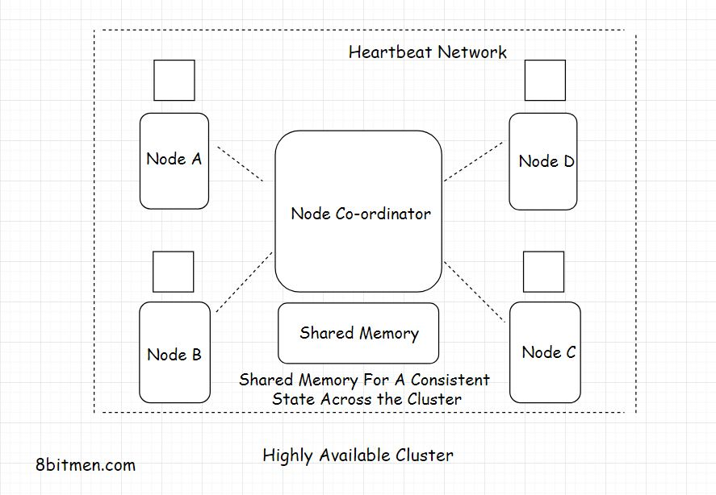

<h1 align="center">High availability</h1>

<!-- TABLE OF CONTENTS -->

  
Table of Contents

  <ol>
    <li>
      <a href="#approach">Approach Vertical & Horizontal Scaling</a>
    </li>
    <li>
      <a href="#reasons-for-system-failures">Reasons For System Failures</a>
    </li>
    <li>
      <a href="#fault-tolerant">Fault tolerant</a>
    </li>
    <li><a href="#redundancy">Redundancy</a></li>
    <li><a href="#high-availability-cluster">High availability cluster</a></li>
  </ol>

 

## Approach
* High availability also known as HA is the ability of the system to stay
online despite having failures at the infrastructural level in real-time.
> Example 99.99999% highly available, it simply means 99.99999% of the total
>hosting time the service will be up. You might often see this in the SLA
>(Service Level Agreements) of cloud platforms.

(<a href="#readme-top">back to top</a>)

## Reasons For System Failures
_Several problems:_
1. Software crashes
2. Hardware failures
3. Human errors &rarr; main reason in several circumstances
4. Planned downtime

(<a href="#readme-top">back to top</a>)

## Fault tolerant
1. A few of the instances/nodes, out of several, running the service go offline &
bounce back all the time. In case of these internal failures, the system could
work at a reduced level but it will not go down entirely.
2. To achieve high availability at the application level, the entire massive service
is architecturally broken down into smaller loosely coupled services called the micro-services:
   * Easier management
   * Easier development
   * Ease of adding new features
   * Ease of maintenance

(<a href="#readme-top">back to top</a>)

## Redundancy

* This approach is also known as Active-Passive HA mode &rarr; Replace active nodes by passive nodes
* Can avoid single points of failure or bottleneck
* Automatic monitoring the system in the realtime
>Since the most common cause of failures is human error, automation helps
>cut down failures to a big extent.

(<a href="#readme-top">back to top</a>)

## High availability cluster

(<a href="#readme-top">back to top</a>)
